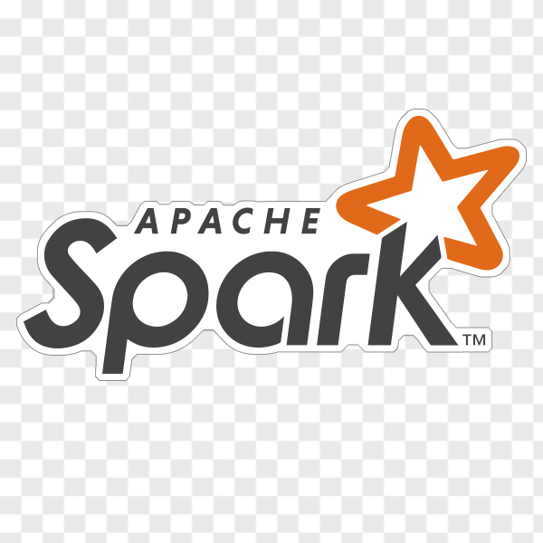

# 
## I'm a funny dad, gym lover and big data engineer!

- 🔭 I’m currently working in a Data Lakehouse architecture with Delta Lake
- 🌱 I’m now building ML workflow and MLOps platform
- 👯 I’m looking to collaborate with other data practitioners
- 🥅 2022 Goal: spend at least 30 minutes every day to study English and Math with my little daughter 
- ⚡ Fun fact:  I'm not a funny engineer

##  Contacts

[][linkedin]
[][outlook]
[][whatsapp]
[][telegram]
[][twitter]
[][skype]
[][facebook]
[][messenger]
[][instagram]

 

## 🔧 Technologies

## 📝 Writing

- [Road to Lakehouse - Part 1: Delta Lake data pipeline overview][lakehouse1]
- [Road to Lakehouse - Part 2: Ingest and process data from Kafka with CDC and Delta Lake’s CDF][lakehouse2]
- [ML workflow with Airflow, MLflow and SageMaker][ml-workflow]
- [Streaming Data Pipelines on Cloud Platforms: AWS and GCP][streaming-data-pipeline]

## 💻 Projects

<!-- links -->

[linkedin]: https://www.linkedin.com/in/tam159
[outlook]: mailto:npt.dc@outlook.com
[whatsapp]: https://wa.me/84968985355
[telegram]: https://telegram.me/tam_159
[twitter]: https://twitter.com/NpT_Dc
[skype]: https://join.skype.com/invite/pUowr2CfAySJ
[facebook]: https://www.facebook.com/phuctam.info/
[messenger]: https://www.facebook.com/phuctam.info/
[instagram]: https://www.instagram.com/npt_dc/
[lakehouse1]: https://www.linkedin.com/pulse/road-lakehouse-part-1-delta-lake-data-pipeline-overview-tam-nguyen
[lakehouse2]: https://tam159.medium.com/road-to-lakehouse-part-2-ingest-and-process-data-from-kafka-with-cdc-and-delta-lakes-cdf-318708468a47
[ml-workflow]: https://tam159.medium.com/ml-workflow-with-airflow-mlflow-and-sagemaker-ad076e5f614b
[streaming-data-pipeline]: https://www.linkedin.com/pulse/streaming-data-pipelines-cloud-platforms-aws-gcp-tam-nguyen
