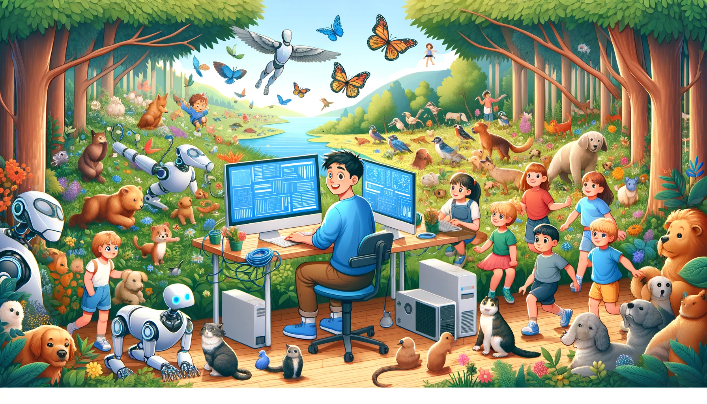
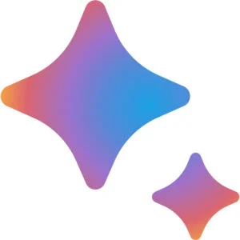
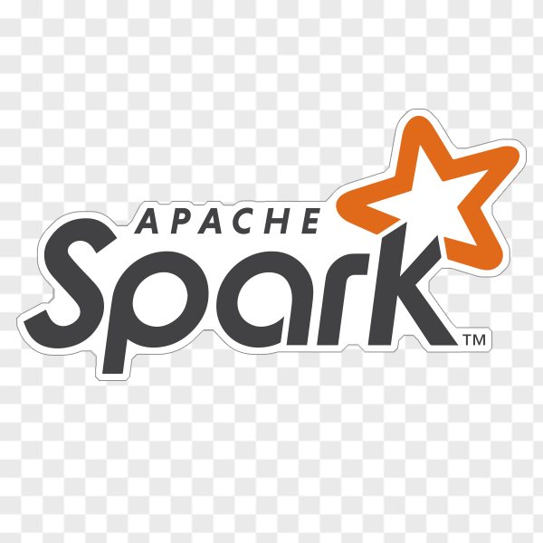
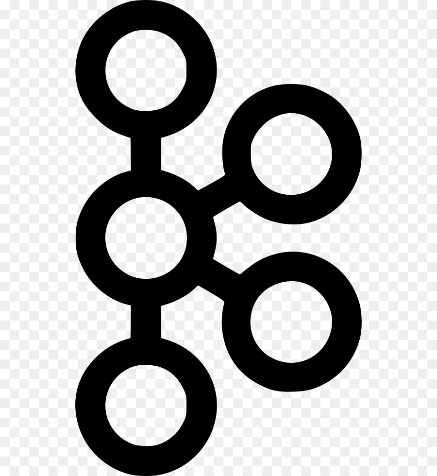

# 
## Hi there! I'm a gym-loving dad and AI/ML engineer with a passion for generative AI.

- 🔭 Working on cutting-edge generative AI projects, from agentic applications and OCR/IDP to LLMOps, ML workflows, data science, and analytics.
- 💪🏼 Bringing a strong software and big data engineering background, including data lakehouse, data fabric, and data mesh architectures.
- 🌱 Actively building agentic AI systems using multi-agent and long-term memory architectures, MCP, A2A, RAG, fine-tuning and knowledge graphs.
- 👯 Seeking collaboration with fellow practitioners in generative AI, ML, and data science.
- 🥅 2025 goal: exercise daily and learn alongside my daughter.
- ⚡ Fun fact: I’m an engineer who’s not very funny (at least not yet)!

##  Contacts

[][linkedin]
[][outlook]
[][whatsapp]
[][telegram]
[][twitter]
[][skype]
[][facebook]
[][messenger]
[][instagram]

 

## 🔧 Technologies

## 📝 Writing

- [Road to Lakehouse - Part 3: Data Analytics with Generative AI][spark-ai]
- [9 Methods to Enhance the Performance of an LLM RAG Application][llm-rag]
- [Road to Lakehouse - Part 1: Delta Lake data pipeline overview][lakehouse1]
- [Road to Lakehouse - Part 2: Ingest and process data from Kafka with CDC and Delta Lake’s CDF][lakehouse2]
- [ML workflow with Airflow, MLflow and SageMaker][ml-workflow]
- [Streaming Data Pipelines on Cloud Platforms: AWS and GCP][streaming-data-pipeline]

## 💻 Projects

<!-- links -->

[linkedin]: https://www.linkedin.com/in/tam159
[outlook]: mailto:npt.dc@outlook.com
[whatsapp]: https://wa.me/84968985355
[telegram]: https://telegram.me/tam_159
[twitter]: https://x.com/NpT_Dc
[skype]: https://join.skype.com/invite/pUowr2CfAySJ
[facebook]: https://www.facebook.com/phuctam.info/
[messenger]: https://www.facebook.com/phuctam.info/
[instagram]: https://www.instagram.com/npt_dc/
[spark-ai]: https://www.linkedin.com/pulse/road-lakehouse-part-3-data-analytics-generative-ai-tam-nguyen-jy8hc
[llm-rag]: https://www.linkedin.com/pulse/9-methods-enhance-performance-llm-rag-application-tam-nguyen-ooljc
[lakehouse1]: https://www.linkedin.com/pulse/road-lakehouse-part-1-delta-lake-data-pipeline-overview-tam-nguyen
[lakehouse2]: https://tam159.medium.com/road-to-lakehouse-part-2-ingest-and-process-data-from-kafka-with-cdc-and-delta-lakes-cdf-318708468a47
[ml-workflow]: https://tam159.medium.com/ml-workflow-with-airflow-mlflow-and-sagemaker-ad076e5f614b
[streaming-data-pipeline]: https://www.linkedin.com/pulse/streaming-data-pipelines-cloud-platforms-aws-gcp-tam-nguyen
