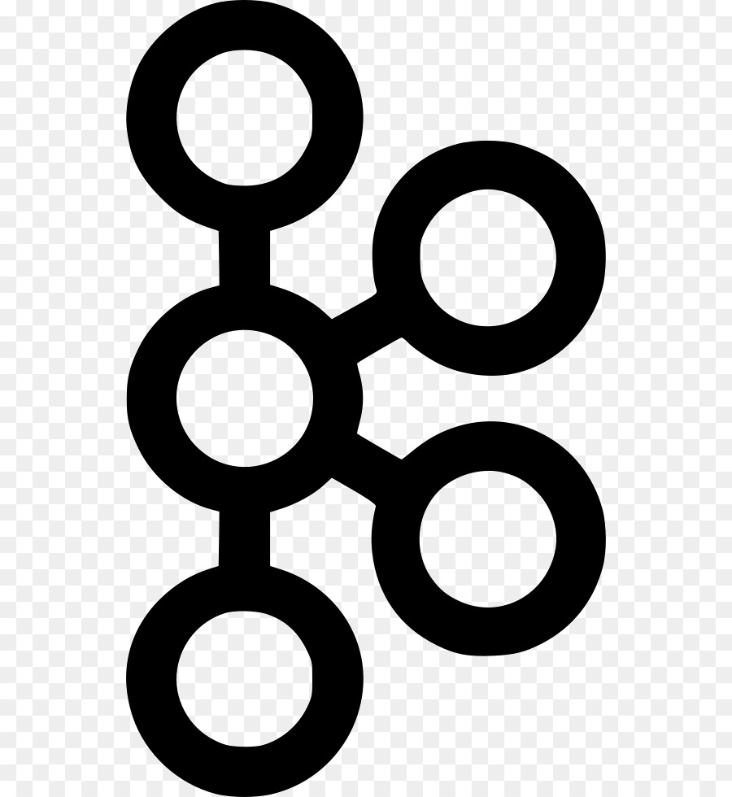

# Hello 

## I'm a funny dad, gym lover and big data engineer!

- 🔭 I’m currently working in a Lake House architecture with Delta Lake
- 🌱 I’m now building ML workflow and MLOps platform
- 👯 I’m looking to collaborate with other data practitioners
- 🥅 2021 Goal: do not get COVID
- ⚡ Fun fact:  I'm not a funny engineer

##  Contacts

[][linkedin]
[][outlook]
[][whatsapp]
[][telegram]
[][twitter]
[][skype]
[][facebook]
[][messenger]
[][instagram]

 

## 🔧 Technologies

[<code>

</code>](https://www.python.org/)
[<code>

</code>](https://docs.oracle.com/en/java/)
[<code>

</code>](https://www.scala-lang.org/)
[<code>

</code>](https://en.wikipedia.org/wiki/SQL)
[<code>

</code>](https://spark.apache.org/)
[<code>

</code>](https://flink.apache.org/)
[<code>

</code>](https://beam.apache.org/)
[<code>

</code>](https://kafka.apache.org/)
[<code>

</code>](https://www.docker.com/)
[<code>

</code>](https://kubernetes.io/)
[<code>

</code>](https://www.tensorflow.org/)
[<code>

</code>](https://www.postgresql.org/)
[<code>

</code>](https://www.kernel.org/)
[<code>

</code>](https://git-scm.com/)
[<code>

</code>](https://aws.amazon.com/)
[<code>

</code>](https://azure.microsoft.com//)
[<code>

</code>](https://cloud.google.com/)
[<code>

</code>](https://www.jetbrains.com/pycharm/)
[<code>

</code>](https://www.jetbrains.com/idea/)
[<code>

</code>](https://code.visualstudio.com/)

## 📝 Writing

[ML workflow with Airflow, MLflow and SageMaker][ml-workflow]

[Streaming Data Pipelines on Cloud Platforms: AWS and GCP][streaming-data-pipeline]

## 💻 Projects

<!-- links -->

[linkedin]: https://www.linkedin.com/in/tam-nguyenphuc/
[outlook]: mailto:npt.dc@outlook.com
[whatsapp]: https://wa.me/84968985355
[telegram]: https://telegram.me/tam_159
[twitter]: https://twitter.com/NpT_Dc
[skype]: https://join.skype.com/invite/pUowr2CfAySJ
[facebook]: https://www.facebook.com/phuctam.info/
[messenger]: https://www.facebook.com/phuctam.info/
[instagram]: https://www.instagram.com/npt_dc/
[ml-workflow]: https://tam159.medium.com/ml-workflow-with-airflow-mlflow-and-sagemaker-ad076e5f614b
[streaming-data-pipeline]: https://www.linkedin.com/pulse/streaming-data-pipelines-cloud-platforms-aws-gcp-tam-nguyen
